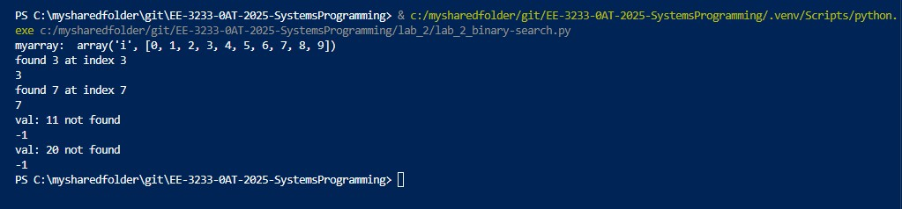
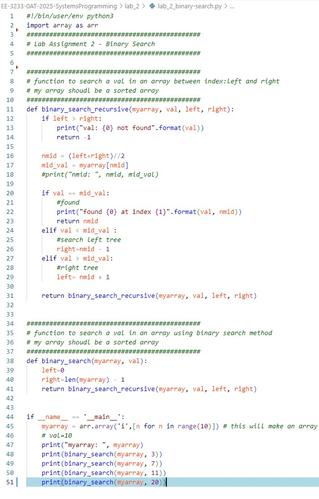

## ----------------------------------------------------------------------------
# Lab Assignment 2: Binary Search
## Name: **Arnav Gupta**
## Utsa abcID : **Enp615**
## ----------------------------------------------------------------------------
**Abstract**: This lab is about writing a python program to perform binary search. I started with 1) setting up my developer environment. I installed VSCode, git, python3 and configured my VSCode environment with many suitable extensions like python, git, markdown etc. to enable me to make use of all SDLC best practices. futher I used python script that implements a recursive binary search algorithm to find a given value in a sorted integer array. for this I used python's in-built module 'array' which provides a space efficient homogenious storage for arrays.

| File                  | Description                     |
|-----------------------|---------------------------------|
| [lab_2_binary-search.py](./lab_2_binary-search.py) | Contains the binary search functions |

**Execution Steps**

**Conclusion**: I have leant the flow of executing python code in VScode (an IDE environment), python in-built array module, writing and calling basic functions in python and recursion concepts. With this I am feeling motivated to contine on my path of continous leaning.

**Source Code**

## ----------------------------------------------------------------------------
## Annexure - Assignment Details
## ----------------------------------------------------------------------------

EE-323:Systems Programming for Engineers

Teaching/Lab Assistant: Kriza Baby

kriza.baby@utsa.edu

Lab Student Hour:  Friday 11:00am to 12:00pm

## Lab Assignment 2
In this assignment your task is to implement a function to do binary search in a sorted array. This is more of a practice assignment for you to start coding with Python3.

### Binary Search
Binary search is a relatively quick algorithm to find an index within a sorted (non-decreasing) array, whose value is equal, or almost equal, to a specified value. Thus, you define the function as:

def binary_search(array, val):

Where array is an input array where you want to find the value val.

The idea behind binary search is that you will inspect the element in the middle of array by making use of two auxiliary indexes: left and right. If the value in such middle index equals to val:

if array[middle] == val:

then you just return middle.

If the value in the middle of the array is less than val, then you need to readjust right. Otherwise, if the value in the middle of the array is more than val, then you need to readjust left. If you keep repeating this process, in a while loop, then the window between left and right should start to shrink until the algorithm eventually finds the correct index middle. However, if the algorithm reaches a point where:

left >= right

You stop and return left. If the element is not present either print the element is not present  or return -1.

Index

0 1 2 3 4 

Value

4 7 11 12 40

                       Left          Middle          Right

Tips
You may eventually want to look for an online tutorial if you are still confused. Don’t worry about it, the binary search algorithm is very popular and easy to implement. The idea of this assignment, however, is for you to familiarize with Python3.

One thing that you may want to consider is that you need to use the floor division operator to calculate the middle index within your while loop. Otherwise, middle may end up getting assigned a floating-point number that should not be used as an index.

Additionally, you can get the length of array as follows:

n = len(array)

Testing
After defining the binary search function, use the following lines of code to test your implementation:

array = [n for n in range(10)]

print(binary_search(array, 3))

print(binary_search(array, 7))

print(binary_search(array, 11))

print(binary_search(array, 20))

 

Which prints 3, 7, -1, -1 on the terminal.

**Deliverables**
Upload a unique PDF file with screenshots of your code and simulation output. Your PDF must include a simple header with your name and your abc123. Submit a file with your work even if you cannot replicate the output shown above.

**Grading**
Full marks will be granted to students that replicate the output, or whose logic is correct.

-1 point if you don’t include the header with your name and abc123 in your file.
-1 point if you only submit the image files to Canvas(.jpeg, .png, etc…)
Submissions with links to screenshots uploaded to the internet will not be accepted.
Make sure that both code and simulation output is attached.
No late submissions will be accepted. Refer to the syllabus.