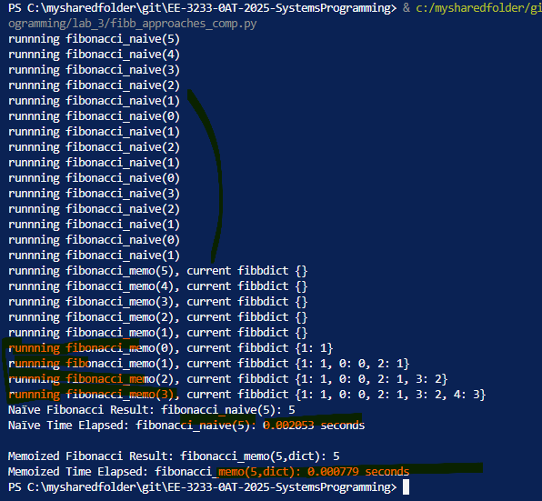
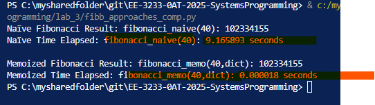
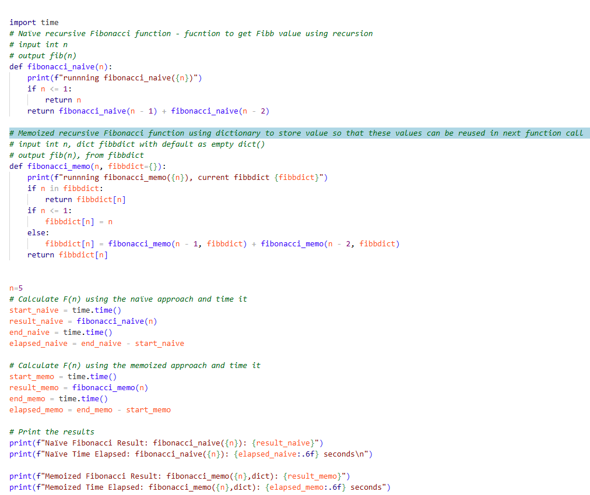
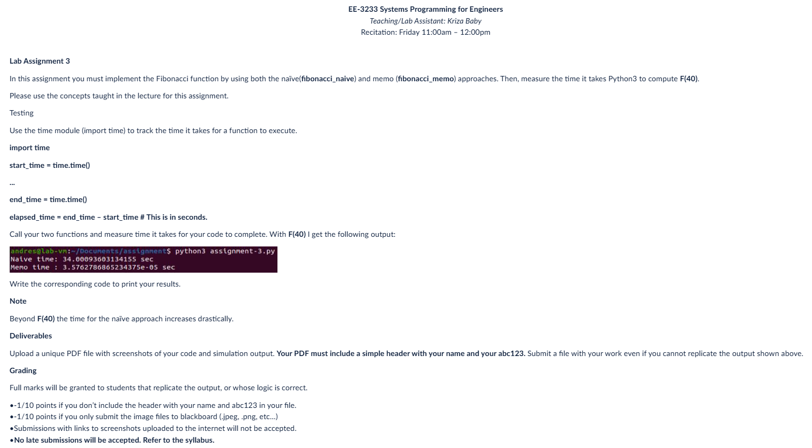
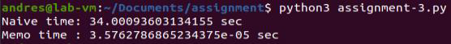

## ----------------------------------------------------------------------------
# Lab Assignment 3: Time Complexity comparison for fibonacci_naive vs Memoized Fibonacci
## Name: **Arnav Gupta**
## Utsa abcID : **Enp615**
## ----------------------------------------------------------------------------
**Abstract**: This lab is about writing a python program to get fibonacci numbers (for a given n) using two difference approaches. Both are based on recursion, But main focus of this exercise is to understand how implemtation of 'call stack' in python impacts time complexity, and what approach can be applied to reduce time complexty for fibonacci_naive i.e. by storing function values in a dictionary, we can reduce repeated function calls and can significantly reduce execution time.


| File                  | Description                     |
|-----------------------|---------------------------------|
| [fibb_approaches_comp.py](./fibb_approaches_comp.py) | Contains the fibbonacci functions |


### Execution Steps

#### Execution Time and function calls for n=5



#### Execution Time for n=40



## Conclusion
**Conclusion**: Learnt importance to understand how call stack is implemented and how it impact algorithms performance.

## Source Code
**Source Code**




```{python}
import time
# This code is to generate a list of fibbnocci series by two diferent approaches 
# Goal is to observe and improve time complexity (total time to execute).
# both approaches use recursion, but once we observe how 'call stack' works in python, we understand how a small change i.e. storing values in an appropariate datastructure makes a big difference in time complexity.

# 1) Naïve Recursive: 
#       time complexity O(2ⁿ)	Repeats subproblems, calls same function multiple times.
# 2) Memoized Recursive	
#       time complexity O(n)	Solves each subproblem only once

# Call Stack : for any program, Python maintains a stack of function calls.
# Each time a function is called, it’s pushed onto the stack, and when it returns, it’s popped off.
# we will observe how function 'call stack' gets populated, pushes a function on top and pops once it executes.

# in both approaches for fib(n): a binary recursion tree will be created as there are two sub-function calls for each function call (fib(n)) = (fib(n-1)) + (fib(n-2))
# and function gets pushed to stack in NLR (node, left, right) order, and gets popped of when it gets executed.
# in this space Order of complexity is O(n), as memeory fn callstack will have function call equal of depth of binary recursive tree. 

# for recursion this function call will be multiple times, 
# fibonacci_naive(5)
# ├─ fibonacci_naive(4)
# │  ├─ fibonacci_naive(3)
# │  │  ├─ fibonacci_naive(2)
# │  │  │  ├─ fibonacci_naive(1) → 1   ← base case
# │  │  │  └─ fibonacci_naive(0) → 0   ← base case
# │  │  └─ fibonacci_naive(1) → 1      ← base case
# │  └─ fibonacci_naive(2)
# │     ├─ fibonacci_naive(1) → 1      ← base case
# │     └─ fibonacci_naive(0) → 0      ← base case
# └─ fibonacci_naive(3)
#    ├─ fibonacci_naive(2)
#    │  ├─ fibonacci_naive(1) → 1      ← base case
#    │  └─ fibonacci_naive(0) → 0      ← base case
#    └─ fibonacci_naive(1) → 1         ← base case

# As the program runs, the call stack looks like this:
    # Top of Stack (Fib(4))
        # runnning fibonacci_naive(4)
        # runnning fibonacci_naive(3)
        # runnning fibonacci_naive(2)
        # runnning fibonacci_naive(1)
        # runnning fibonacci_naive(0)
        # runnning fibonacci_naive(1)
        # runnning fibonacci_naive(2)
        # runnning fibonacci_naive(1)
        # runnning fibonacci_naive(0)
    # Bottom of Stack (bottom will be executed first)
# and max. stack depth is (height of recursive binary tree, which is n) for fibonacci_naive(n), stack space is O(n)


# first approach: 
# here we will observe that many sub-functions will be called multiple times, causing to increase time complexity.
# with time complexity of O(2**n) and space complexity if O(n)

# second approach: 
# if we store these values in a dict, then time to execute will be far less.

# For time Complxity, we will understand that there 2 function calls made for each function 
# Space Complexity:

# Space Complexity:
# O(n) for the memo dictionary
# O(n) for recursion stack
# Total: O(n)

# Summary
# Approach	Time Complexity	Space Complexity
# Naïve Recursive	O(2ⁿ)	O(n)
# Memoized Recursive	O(n)	O(n)


# Naïve recursive Fibonacci function - fucntion to get Fibb value using recursion 
# input int n 
# output fib(n)
def fibonacci_naive(n):
    print(f"runnning fibonacci_naive({n})")
    if n <= 1:
        return n
    return fibonacci_naive(n - 1) + fibonacci_naive(n - 2)

# Memoized recursive Fibonacci function using dictionary to store value so that these values can be reused in next function call
# input int n, dict fibbdict with default as empty dict()
# output fib(n), from fibbdict 
def fibonacci_memo(n, fibbdict={}):
    print(f"runnning fibonacci_memo({n}), current fibbdict {fibbdict}")
    if n in fibbdict:
        return fibbdict[n]
    if n <= 1:
        fibbdict[n] = n
    else:
        fibbdict[n] = fibonacci_memo(n - 1, fibbdict) + fibonacci_memo(n - 2, fibbdict)
    return fibbdict[n]


n=5
# Calculate F(n) using the naïve approach and time it
start_naive = time.time()
result_naive = fibonacci_naive(n)
end_naive = time.time()
elapsed_naive = end_naive - start_naive

# Calculate F(n) using the memoized approach and time it
start_memo = time.time()
result_memo = fibonacci_memo(n)
end_memo = time.time()
elapsed_memo = end_memo - start_memo

# Print the results
print(f"Naïve Fibonacci Result: fibonacci_naive({n}): {result_naive}")
print(f"Naïve Time Elapsed: fibonacci_naive({n}): {elapsed_naive:.6f} seconds\n")

print(f"Memoized Fibonacci Result: fibonacci_memo({n},dict): {result_memo}")
print(f"Memoized Time Elapsed: fibonacci_memo({n},dict): {elapsed_memo:.6f} seconds")


```


## Annexure: Lab Assignment 3 



Lab Assignment 3

In this assignment you must implement the Fibonacci function by using both the naïve(fibonacci_naive) and memo (fibonacci_memo) approaches. Then, measure the time it takes Python3 to compute F(40).

Please use the concepts taught in the lecture for this assignment.

Testing

Use the time module (import time) to track the time it takes for a function to execute.

import time

start_time = time.time()

...

end_time = time.time()

elapsed_time = end_time – start_time # This is in seconds.

Call your two functions and measure time it takes for your code to complete. With F(40) I get the following output:



Write the corresponding code to print your results.

Note

Beyond F(40) the time for the naïve approach increases drastically.

Deliverables

Upload a unique PDF file with screenshots of your code and simulation output. Your PDF must include a simple header with your name and your abc123. Submit a file with your work even if you cannot replicate the output shown above.

Grading

Full marks will be granted to students that replicate the output, or whose logic is correct.

•-1/10 points if you don’t include the header with your name and abc123 in your file.
•-1/10 points if you only submit the image files to blackboard (.jpeg, .png, etc…)
•Submissions with links to screenshots uploaded to the internet will not be accepted.
•No late submissions will be accepted. Refer to the syllabus.